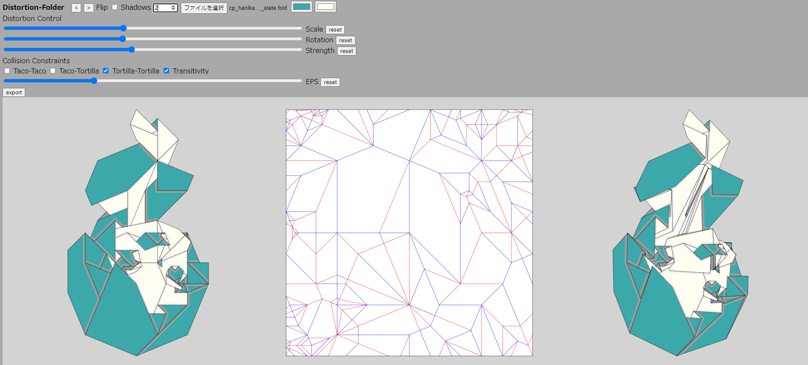

# Distortin-Folder: A Folded State Distorter

Distortin-Folder is software written by [Kei Morisue](https://x.com/keimorisue) to
distort valid flat-foldable states of flat-foldable crease patterns exported from [Flat-Folder](https://origamimagiro.github.io/flat-folder/) or [Sequence-Folder](https://origamimagiro.github.io/sequence-folder/) written by [Jason S. Ku](http://jasonku.mit.edu/). This Software is also originally written by him. 

## How to use

1. Go to [Distortin-Folder](https://kei-morisue.github.io/distorted-folder/).
    - Tested to run in Chrome.

1. It automatically processes [sample file](./sample/opensink_water_bomb.fold).
    1. Press "<" or ">" to switch the steps of the sequence.
    1. Check "Flip" to show the backside in the folded model in the right figure.
    1. Check "Shadows" to add shade in the folded model in the right figure.
    1. Use two color pickers to select the colors on top/bottom side of the paper.

1. "Distortion control" to find distorted figure in the right.
    - Mainly control 2 parameters: "Scale" and "Rotation".
    - "Strength" manages the amount of distortion while the propotion of "scale" and "rotation" does not change. 
    - If the distorted state is not shown, the distortion is strong too much. Make "Scale" and "Rotation" to near the reset position (the center) or make "Strength" smaller.

1. If any parameters do not output the distorted state, try weakenning "Collision Constraints". Distortin-Folder infers all the face orders in the input file (i.e. undistorted state) while it has to calculate possible states of newly found overrapping face pairs by the distortion. 
Some input are not consisitent with fully valid constraints (check more for [Flat-Folder](https://origamimagiro.github.io/flat-folder/)): 
    - Taco-Taco : avoids all the collisions of two creases.
    - Taco-Tortilla : avoids all the collisions of a crease and a face.
    - Tortilla-Tortilla : avoids all the collisions of two faces.
    - Transitivity: avoids all the collisions of three faces.

    Thus sometimes you need to uncheck those constraints so that the distorted figure can be calculated.
    - If you uncheck all of the constraints, logically there must be at least one valid state.
    - Distortin-Folder shows one of all the valid state which is found.
    - You do not have options to select those states at this stage.  

1. If any parameters or constraints do not output the distorted state, try to put smaller "EPS". 
    - Technically, the software depends on calculation accuracy to forecast the intersections of segments. 
    - Basically tiny distortions make tiny fragments of intersections and sometimes breake those accuracies.
    - "EPS" parameter puts those accuracies more sharp so that the calculation can find even those tiny fragments of intersections.
    - Too much small "EPS" occurs unexpected calculations. 

1. Press "Export" to save the distorted state in .fold or .svg formats.

1. Press "Choose File" to upload a folded state in FOLD file formats (.fold).

## The distortion logic
- The expression is given as following:

    $d_i = f_i + Av_i-v_i.$
    - $i=1,2,\dots , N$ : index for $N$ vertices on the crease pattern.
    - $v_i\in \mathbb{R}^2$ : coordinate on the crease pattern for $i$-th vertex.
    - $f_i\in \mathbb{R}^2$ : coordinate on the folded state for $i$-th vertex.
    - $d_i\in \mathbb{R}^2$ : coordinate on the distorted state for $i$-th vertex.
    - $A:\mathbb{R}^2\to\mathbb{R}^2$ : any 2x2 matrix that specifies the distortion.

- The parametrization is gives as following:

    $A=(1 + 2^{1/\epsilon}\cdot(s-1/2))\cdot R(\pi\cdot 2^{1/\epsilon}\cdot(\theta-1/2)).$
    - $\epsilon \in (0,1]$ : the strength parameter.
    - $s\in (0,1]$ : the scale parameter.
    - $\theta\in [0,1]$ : the rotation parameter.
    - $R(\theta):=\left(
    \begin{array}{cc}
        \cos{\theta} & -\sin{\theta}  \\
        sin{\theta} & \cos{\theta} \\
    \end{array}
    \right)$ : the rotation matrix.
    - For operational convenience, remaining 2 essential parameters out of 4 entities in the arbitrarity of the matrix $A$ is omitted. 